# How to Create an SSH Key on Windows

This guide will help you create an SSH key pair on Windows 11. It should cover most of the same procedure on macOS and Linux also.

## What is an SSH Key?

An SSH key is a secure way to log into your servers and services (like Github) without using a password. It consists of a public key (which you share) and a private key (which you keep secure).


## 1. Install and/or Open "Terminal"

- Look into your Windows menu for the application "Terminal"

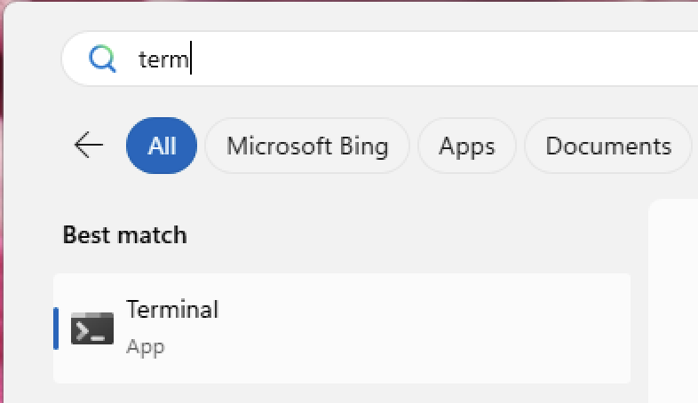{: width="50%"}

- If it's not there, you can install it through "Microsoft Store"

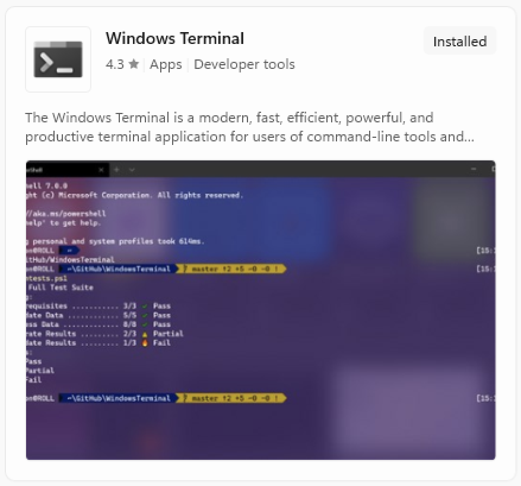{: width="50%"}

- Open "Terminal", you should see something like this:

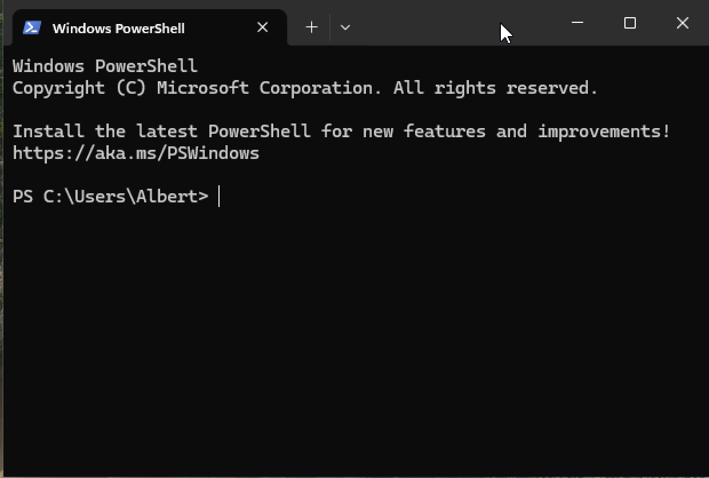{: width="50%"}


## 2. Check for Existing SSH Keys

Before creating a new key, check if you already have one by typing this into your Terminal:

```
ls ~/.ssh/id_*
```
<small>*What is this? `ls` stands for `list`, `~` designates your Home directory, then `.ssh/id_*` point to any file starting with `id_` inside the `.ssh` folder inside your Home directory.*</small>

If you already have SSH keys you should see something like this, and you can already jump to the last step of this tutorial:

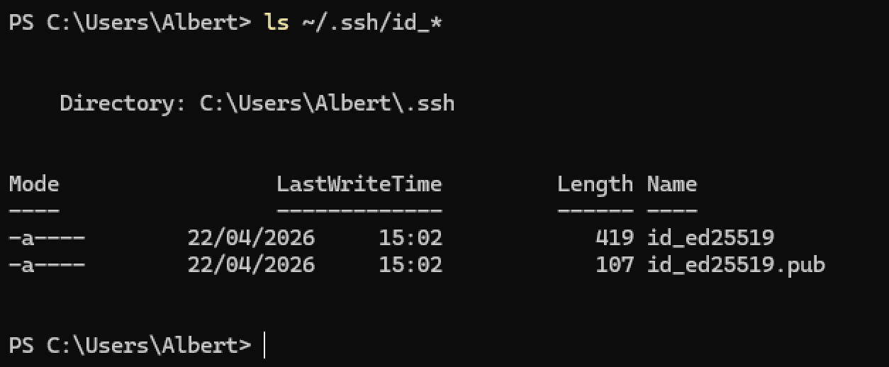{: width="70%"}

If nothing or an error shows (like shown below), it means you don't have any SSH key yet and that you can move on to the next step.

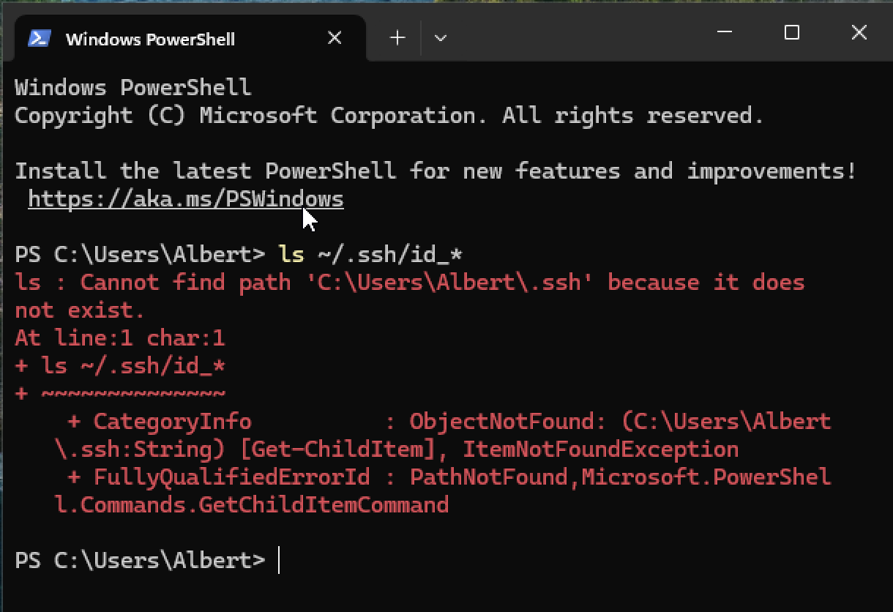{: width="70%"}


## 3. Generate a New SSH Key Pair

Type this command in your Terminal, then change the example email address with your own

```
ssh-keygen -t ed25519 -C "your_email@example.com"
```

When asked for where to save the file or passphrase, just press Enter without typing anything else.

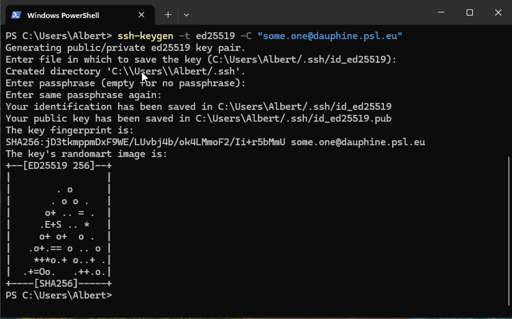{: width="80%"}

Congrats, you've just created a SSH Key pair.


## 4. Share your ssh **public** key

After running the command, you should see two files in the `C:\Users\YourUsername\.ssh` folder:

- `id_ed25519` (private key, **never share this!**)
- `id_ed25519.pub` (public key, share this)

You can open `id_ed25519.pub` with "Notepad" or print its content using "Terminal" as shown below:

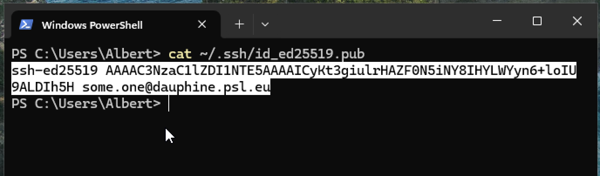{: width="80%"}

Copy the content of your key, which should look like something like this:

```
ssh-ed25519 AAABC3NzaC1lZDI1NTE5AAAAICyLt3giulrRAZF0N5iNY8IHYLWZyn6+loIU9ALDIh5H some.one@dauphine.psl.eu
```

And send it by email to you system/server administrator.

From there, you can either [use VSCode to setup your SSH access](./setup_vscode.md) to a remote server, or follow the following section of this tutorial to do it without VSCode.

If you plan to use VS Code, stop here and follow the [VS Code setup guide](./setup_vscode.md)—VS Code will handle the SSH configuration for you. Otherwise, continue below to set up command-line SSH access.


## (5.) Setup your SSH access without VSCode (command-line access)

You must have received a SSH configuration from your remote server administrator, which should look like this:

```
Host SomeServerNickname
  HostName 123.45.6.789
  User albert
  Port 22
  IdentityFile ~/.ssh/id_ed25519
```

<small>*What is this? `Host` is a simple name given to the server used has a shorthand, you can edit it as you please, `Hostname` is the IP address of the server, its location on the Internet,`User` is your username on the server, `Port` is something like the "door number" used to connect to the remote machine, lastly, `IdentityFile` is the path on your local machine to your SSH private key.*</small>

Go to your Home directory, which should be in the drive `C:`, then `Users`, then your Windows username. You should see a `.ssh` folder. If not, toggle the option to see "Hidden items" in the "View" menu, as shown below:

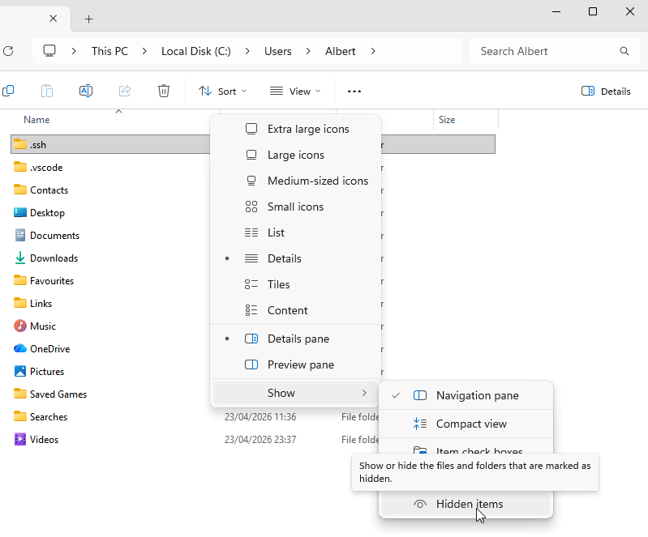{: width="80%"}

Open the `.ssh` folder. You should see the keys you've just created. If there is already a file named `config` open it with Notepad and append the SSH configuration sent by your server administrator.

If not, open "Notepad" and paste the configuration text, then save the file to this folder.

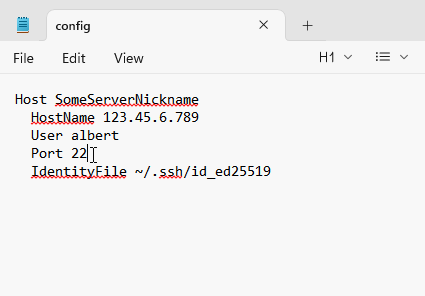{: width="70%"}

Watch out for Notepad's default behavior to append `.txt` to the file name, make sure the menu "Save as type" is set to "All files" and not "Text documents", and to surround the filename with double quotes, as in `"config"` (see picture below).

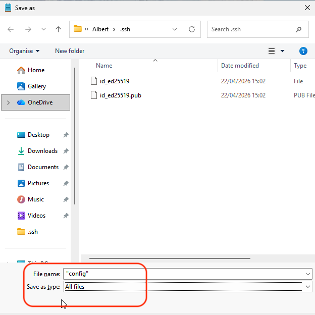{: width="80%"}


**Connect to the server**

You should be now able to connect to the remote server via "Terminal" by typing `ssh SomeServerNickname`. The first time you connect to a newly configured server, you're asked to acknowledge their "fingerprint", that is to "trust" the server", just type "yes". Then, *voilà*.

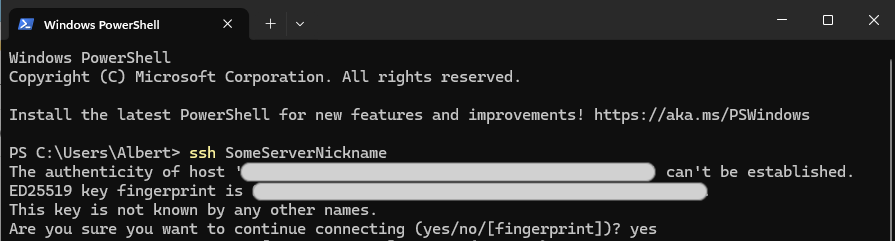{: width="80%"}

