# How to setup your SSH access with VSCode

You don't necessarily need VSCode to connect to a remote server via SSH, but it makes things simpler and helps avoiding the use of the command line (Terminal) for most of your work.

## Installing VSCode

- Download and install VSCode from the official website: <https://code.visualstudio.com/>

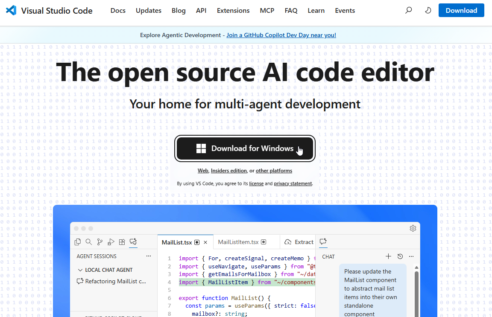{: width="70%"}

- Once installed and opened for the first time you should get something like shown below. You can click on "Mark done" to get rid of the welcome screen.

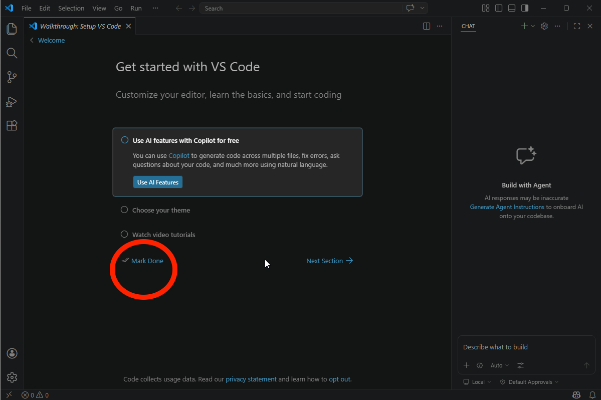{: width="90%"}

- You can get rid of the annoying "Build with Agent" pane on the right by going to "File > Preferences > Settings"

{: width="70%"}

- Search for "AI Features" and toggle the option "Disable and hide built-in AI features..."

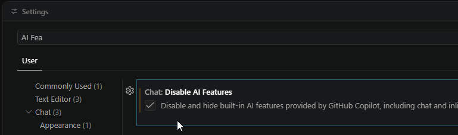{: width="80%"}

- Close the settings window, and you're good to go.

## Installing SSH extension

One of the main advantage of VSCode is that it has a vast ecosystem of "extensions", that is, plugins allowing users to tailor the editor to their specific needs and usecases.

- On the left, click on the "extensions" button...

{: width="70%"}

- ... and search for "SSH" and install the "Remote - SSH" extension

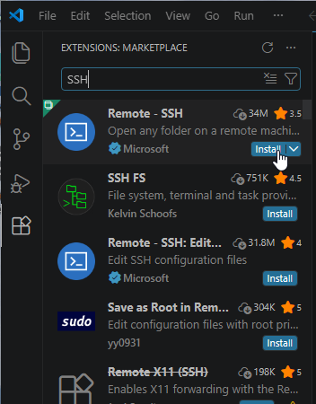{: width="60%"}

## Configuring your SSH access to a remote server

You must have received a SSH configuration from your remote server administrator, which should look like this:

```
Host SomeServerNickname
  HostName 123.45.6.789
  User albert
  Port 22
  IdentityFile ~/.ssh/id_ed25519
```

<small>*What is this? `Host` is a simple name given to the server used has a shorthand, you can edit it as you please, `Hostname` is the IP address of the server, its location on the Internet,`User` is your username on the server, `Port` is something like the "door number" used to connect to the remote machine, lastly, `IdentityFile` is the path on your local machine to your SSH private key.*</small>

- From VS Code, you can use the "Command palette" to access any function from VS Code or the extensions you installed. Enter the "Command palette" through the menu "View" > "Command Palette".

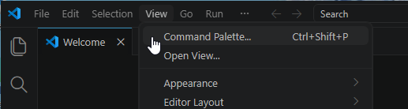{: width="80%"}

- From the command palette, type "ssh" to show related commands, and click on "Remote-SSH: Open SSH Configuration File..."

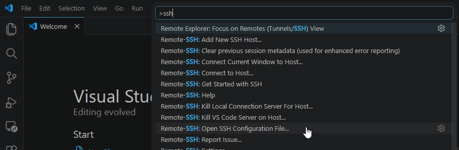{: width="100%"}

- If asked which configuration file to choose, pick the path where you System username appears (in the example below, "C:\Users\Albert\\.ssh\config")

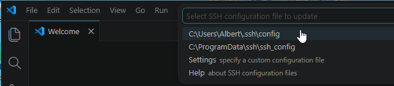{: width="80%"}

- Paste the configuration details given by your server administrator.

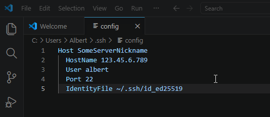{: width="80%"}

- Save and close the file.


## Connect to a remote server

Now that you edited your SSH configuration you should be able to connect to the remote server.

- Again, enter the command palette ("View" > "Command Palette")

{: width="80%"}

- Type "SSH" and clik on "Connect to Host..."

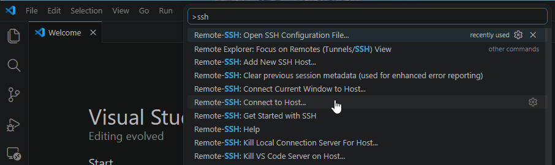{: width="100%"}

- You should see the server nickname you just setup, click on it.

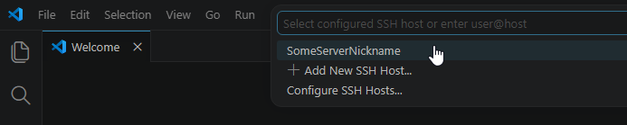{: width="80%"}

- You're going to be asked the operating system of the server, it should be "macOS" or "Linux", if you don't know, ask your server admin.

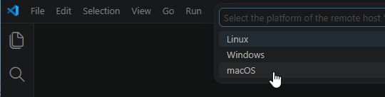{: width="60%"}

- Then, if you trust the server's fingerprint: select "continue"

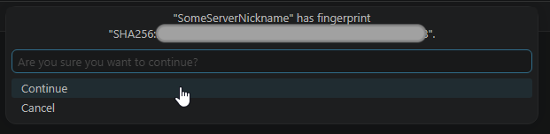{: width="70%"}

- Then, wait for VS Code to install several things on the remote server...

That should be it, you're now connected to the server from VSCode. Let's see how to do basic operations with files there.

## Explore, upload and create files on the server using VS Code

- With VS code connected to your remote server, you can click on the files icon (1) to toggle the file explorer pane, click on "Open folder" (2) and select the default, your remote home folder (3).

{: width="100%"}

- If asked, tell VS Code to trust this folder

{: width="60%"}

- You can now browser your remote home folder from within VS Code, right-click offers common file operations, like creating a folder.

{: width="60%"}

- You can drag-and-drop some file on your local machine to your remote server

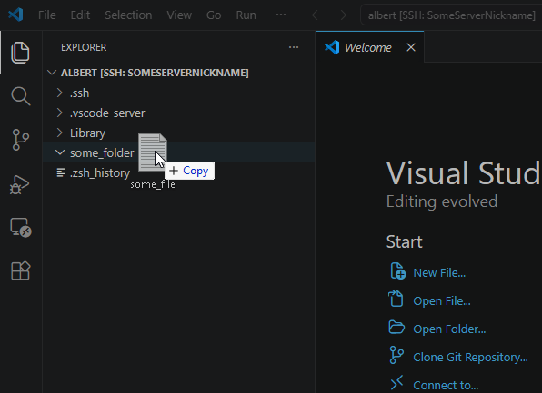{: width="80%"}

*Voilà*.

Tutorials are available in order to help you setup your working environment for [R]() and [Python]().
