# Working with R using VS Code

This tutorial walks you through the setup of VS Code for working with R, eventually on a remote server.

If you intend to work on a remote server, you have to perform these steps after opening the SSH connection within VS Code as explained [here](./setup_vscode.md#how-to-connect)

## Installing the R extension

One of the main advantages of VSCode is that it has a vast ecosystem of "extensions", that is, plugins allowing users to tailor the editor to their specific needs and usecases.

- On the left, click on the "extensions" button...

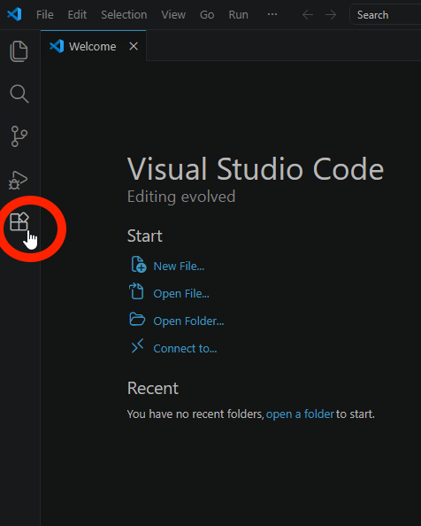{: width="70%"}

- ... and search for "R" and install the "R" extension

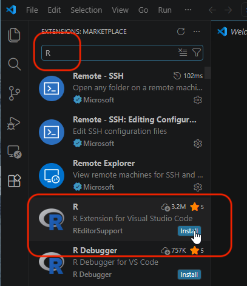{: width="60%"}

- If asked, "Trust" the publisher

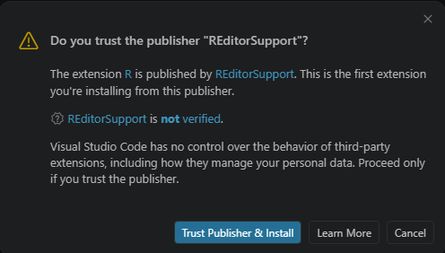{: width="60%"}

## Edit settings

A couple edits in the settings will smooth your R workflow.

- Open settings through the menu: File > Preferences > Settings

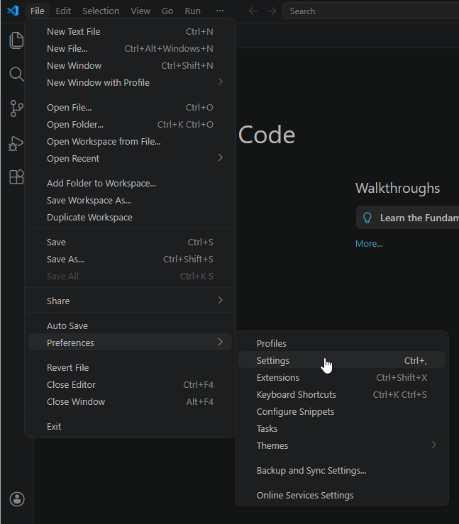{: width="70%"}

- Search for "httpgd" and toggle the option "R > Plot: Use Httpgd"

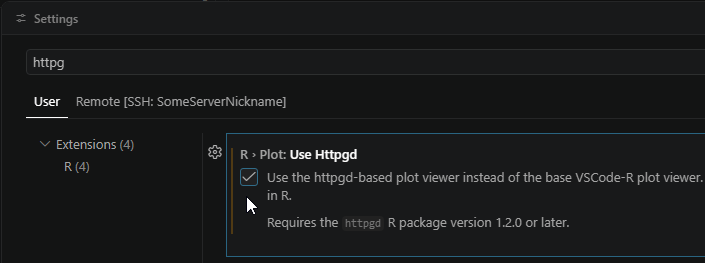{: width="90%"}

- If the server is a Mac and Radian (a better R console) is installed, search for "rterm" and edit the option "R > Rterm: Mac" with the following path: `/opt/homebrew/bin/radian`

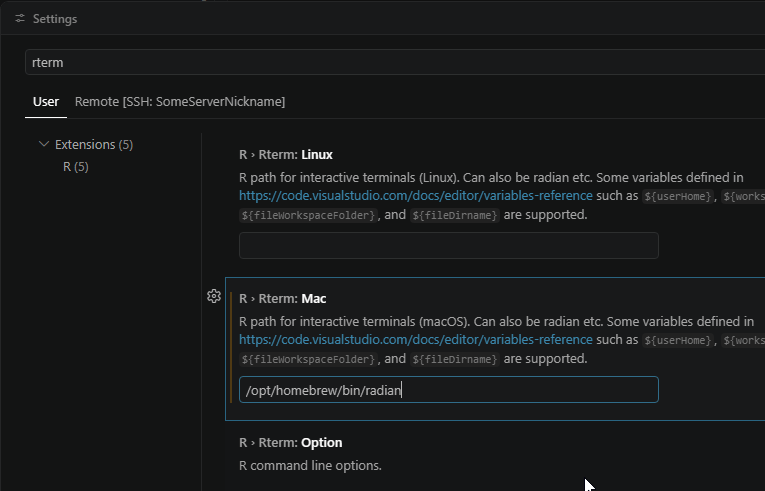{: width="90%"}

- Close the "Settings" window and you're good to go.

## Basic usage

- With VS code connected to your remote server, you can click on the files icon (1) to toggle the file explorer pane, click on "Open folder" (2) and select the default, your remote home folder (3).

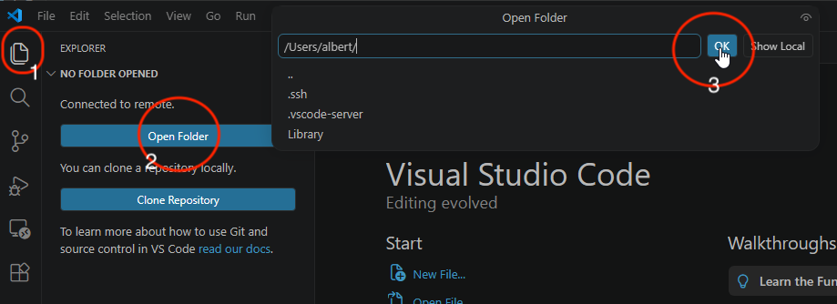{: width="100%"}

- If asked, tell VS Code to trust this folder

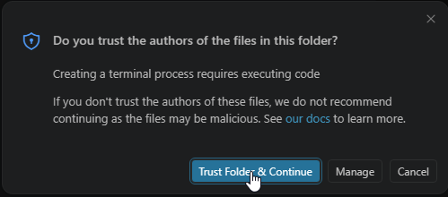{: width="60%"}

- Let's create a folder named "some_R_project" by right-clicking inside the explorer pane

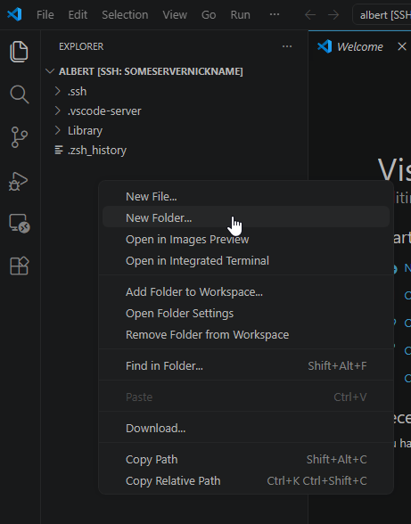{: width="60%"}

- Right-click on the folder and create now a new file named "some_R_script.R", the ".R" at the end is important, it's what makes VS Code consider the file as an R script.

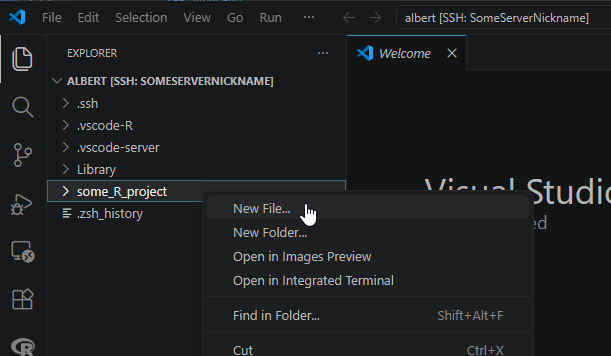{: width="70%"}

- Add some simple code to test printing in the console as well as plotting, for instance:

```R
print("Hello")

x <- 1:10
y <- x^2
plot(x, y)
```
- Run the script by clicking the "Play" icon

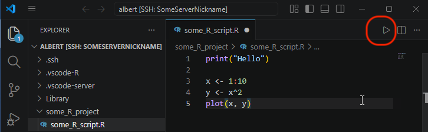{: width="80%"}

- *Voilà*, you should have the console printing "Hello" and a pane showing the plot. Click on the "R" icon on the left (see below) to toggle your "Workspace" with your variables and some other R features.

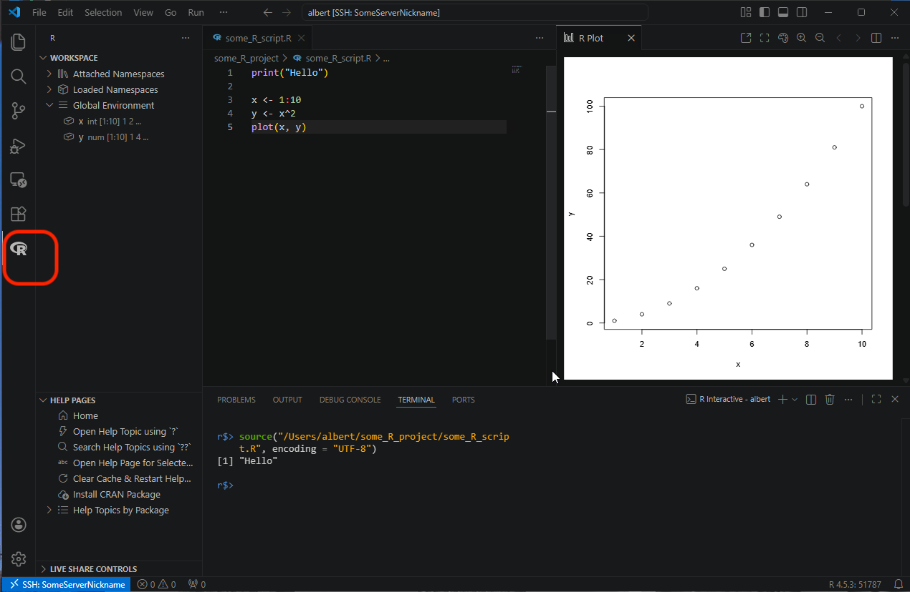{: width="100%"}


There are many other options and features available, feel free to explore.
